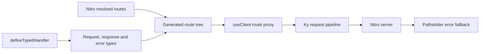

<div align="center">

# Pathstrider

### Walk through Nitro routes with end-to-end types.

Pathstrider reads the routes Nitro actually resolved, turns them into an Eden-style client, and
keeps request, response, and error types connected without a second route contract.

[](https://www.npmjs.com/package/pathstrider)
[](https://github.com/YanChenBai/pathstrider/blob/main/LICENSE)
[](https://github.com/YanChenBai/pathstrider/stargazers)

[Quick Start](#quick-start) · [Typed Routes](#a-typed-route) · [Error Model](#one-error-shape) ·
[Client](#the-client) · [GitHub](https://github.com/YanChenBai/pathstrider)

> Inspired by Elysia and Eden Treaty. Built for Nitro and Ky.

</div>

> [!NOTE]
> Pathstrider is in early development. Its core contract is intentionally small while the runtime
> and type behavior settle.

## Why Pathstrider?

Nitro already knows where your routes are. Your handlers already know their request and response
types. Pathstrider connects those facts instead of asking you to describe the API again.

- Follows Nitro's resolved routes, including configured and programmatic routes.
- Generates a tree-shaped client with static, dynamic, and catch-all paths.
- Accepts every [Standard Schema](https://standardschema.dev/) implementation.
- Uses a fixed error shape across the server, Nitro fallback, and client.
- Exposes Ky's request options and hooks directly through `useClient`.
- Emits JavaScript and declaration sourcemaps.

## Quick Start

Install Pathstrider in an existing Nitro project. This example uses Zod, but any Standard Schema
implementation works:

```bash
pnpm add pathstrider zod
```

Register the plugin after Nitro:

```ts
// vite.config.ts
import { pathstrider } from 'pathstrider/vite';
import { nitro } from 'nitro/vite';
import { defineConfig } from 'vite';

export default defineConfig({
  plugins: [
    nitro(),
    pathstrider({
      output: {
        types: './pathstrider.d.ts',
      },
      scan: {
        include: ['/api/**'],
        exclude: ['/api/internal/**'],
      },
    }),
  ],
});
```

The default declaration output is `pathstrider.d.ts`. Keep it inside the TypeScript project's
`include` scope.

`scan` only filters routes already resolved by Nitro. It supports `include`, `exclude`, and
uppercase HTTP `methods`; it does not maintain an independent source directory.

## A Typed Route

`defineTypedHandler` accepts Standard Schema definitions for request input and responses:

```ts
// server/api/users/[id].get.ts
import { z } from 'zod';

import { defineTypedHandler } from 'pathstrider';

const UserSchema = z.object({
  id: z.string(),
  name: z.string(),
});

const UserNotFoundSchema = z.object({
  code: z.literal('USER_NOT_FOUND'),
  message: z.string(),
  details: z.object({
    userId: z.string(),
  }),
});

export default defineTypedHandler(
  async ({ params, status }) => {
    const user = await findUser(params.id);

    if (!user) {
      return status(404, {
        code: 'USER_NOT_FOUND',
        message: 'User does not exist',
        details: {
          userId: params.id,
        },
      });
    }

    return user;
  },
  {
    params: z.object({
      id: z.string(),
    }),
    response: {
      200: UserSchema,
      404: UserNotFoundSchema,
    },
  },
);
```

A single response schema is shorthand for status 200:

```ts
defineTypedHandler(handler, {
  response: UserSchema,
});
```

Equivalent form:

```ts
defineTypedHandler(handler, {
  response: {
    200: UserSchema,
  },
});
```

Successful responses are validated at runtime. Non-success response schemas currently provide
input and client inference only; Pathstrider still verifies their common error shape at runtime.

## One Error Shape

Every response error uses the same wire structure:

```ts
type PathstriderError<Code extends string = string, Details = never> = {
  code: Code;
  message: string;
} & ([Details] extends [never] ? {} : { details: Details });
```

Request validation failures become:

```json
{
  "code": "VALIDATION_ERROR",
  "message": "Request validation failed",
  "details": {
    "target": "query",
    "issues": []
  }
}
```

Unhandled failures become a safe `INTERNAL_SERVER_ERROR`. Pathstrider also installs a Nitro error
handler before Nitro's built-in fallback, so errors outside a typed handler retain the same JSON
shape without replacing user-configured Nitro error handlers.

## The Client

`useClient` is bound to the generated application route types by default:

```ts
import { useClient } from 'pathstrider/client';

const api = useClient();

const result = await api.users({ id: 'user-1' }).get();

if (!result.error) {
  console.log(result.data.name);
}
```

HTTP errors throw by default, after Pathstrider has parsed the response:

```ts
import { type Client, isClientHTTPError, useClient } from 'pathstrider/client';

const api = useClient();

const user = api.users({ id: 'missing' });
type GetUserError = Client.Error<typeof user.get>;

try {
  await user.get();
} catch (error) {
  if (isClientHTTPError<GetUserError>(error) && error.status === 404) {
    console.error(error.value.code, error.value.details.userId);
  }
}
```

Disable throwing to use an Eden-style result instead:

```ts
import { useClient } from 'pathstrider/client';

const api = useClient({
  baseUrl: 'https://example.com/api/',
  throwHttpErrors: false,
});

const { data, error } = await api.users({ id: 'user-1' }).get();

if (error) {
  console.error(error.status, error.value);
} else {
  console.log(data.name);
}
```

## Ky, Built In

`useClient` accepts Ky options directly. Authentication, retries, timeouts, request mutation, and
other transport behavior use the same names and hooks as Ky:

```ts
import { useClient } from 'pathstrider/client';

const api = useClient({
  baseUrl: '/api/',
  headers: {
    'x-client': 'web',
  },
  hooks: {
    beforeRequest: [
      ({ request }) => {
        request.headers.set('authorization', readAccessToken());
      },
    ],
  },
  retry: 2,
  timeout: 15_000,
});
```

Pathstrider's normalized lifecycle observers live under `pathstriderHooks`, leaving Ky's `hooks`
untouched:

```ts
const api = useClient({
  pathstriderHooks: {
    onResponseError({ error }) {
      reportError(error.status, error.value.code);
    },
    onRequestError({ error }) {
      reportNetworkFailure(error);
    },
  },
});
```

Response hooks are observers and do not silently replace inferred route errors.

## How It Works



No separate route scanner is involved. Nitro remains the source of truth for routing, while the
handler remains the source of truth for request and response behavior.

## Development

```bash
vp install
vp check
vp test --run
vp run build
```

## Acknowledgements

Pathstrider's route tree and error narrowing are inspired by
[Elysia](https://elysiajs.com/) and [Eden Treaty](https://elysiajs.com/eden/treaty/overview).
Its transport layer is powered by [Ky](https://github.com/sindresorhus/ky), and route discovery is
owned by [Nitro](https://nitro.build/).
